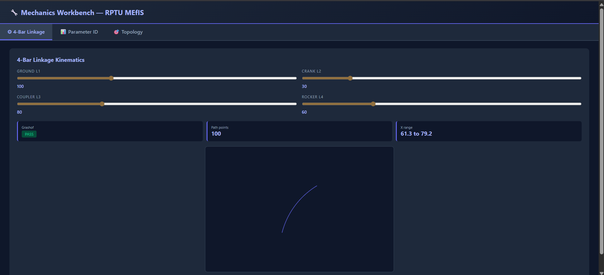
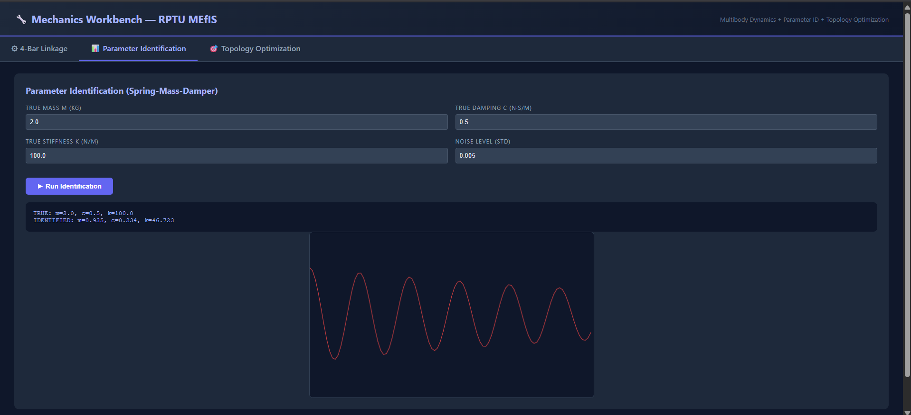
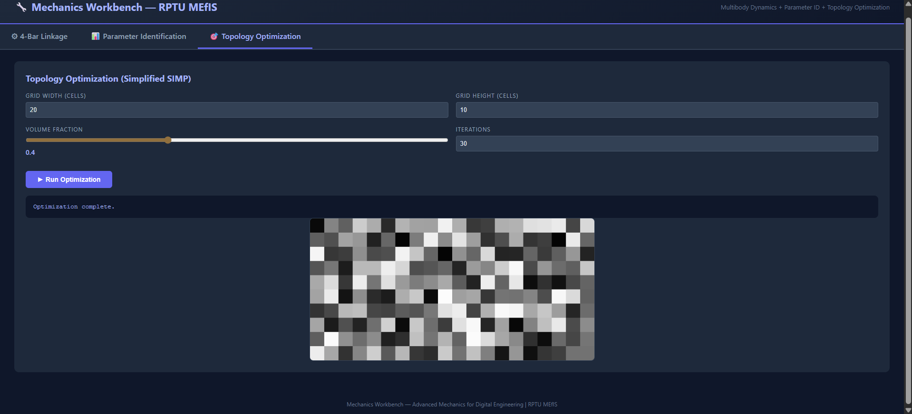

# 🔧 Mechanics Workbench
 

 
## Overview
Full-stack mechanical engineering workbench combining 3 advanced tools:
1. **4-Bar Linkage Kinematics** — multibody simulation with Grashof check
2. **Parameter Identification** — least-squares ID from noisy spring-mass-damper data
3. **Topology Optimization** — simplified SIMP density field for 2D cantilever
 
## 🔗 Live Demo
**[Open Workbench]( https://mechanics-workbench.onrender.com)** _(may take 30s on first load)_
 
## Tab 1: 4-Bar Linkage Kinematics
- Adjustable link lengths L1, L2, L3, L4
- Grashof condition check (full rotation possible?)
- Real-time coupler path generation (locus of L3 midpoint)
- Newton-Raphson position analysis using Freudenstein equations
 
## Tab 2: Parameter Identification
- Spring-mass-damper system: m·ẍ + c·ẋ + k·x = F(t)
- Forced harmonic response with configurable noise
- Least-squares fit using SciPy L-BFGS-B with bounds
- Compares true vs identified parameters with % error
 
## Tab 3: Topology Optimization
- 2D rectangular design domain
- Configurable volume fraction constraint
- Simplified SIMP-style density gradient updates
- Visual rendering of optimal material distribution
 
## Key Models
**Four-bar:** Freudenstein closure equations + Newton-Raphson
**Parameter ID:** Frequency response H(ω) = (F₀/k) / √[(1-r²)² + (2ζr)²]
**Topology:** density-based SIMP penalization with volume constraint
 
## Plots

 
## Relevance to RPTU MEfIS
- Specialization: **"Advanced Mechanics for Digital Engineering"**
- Mechanical modelling ✅
- Numerical methods ✅
- Optimization ✅
- Parameter identification ✅
- Programming ✅
 
## Tools
Python, Flask, HTML5 Canvas, JavaScript, NumPy, SciPy, Gunicorn
 
## Author
**Oscar Vincent Dbritto** | M.Sc. Digitalization & Automation | [Portfolio](https://oscardbritto.framer.website/) | [Linkedin](https://www.linkedin.com/in/oscar-dbritto/)
